# Realtime Strategy AI

- [Abstract](#abstract)
- [1. Introduction](#1-introduction)
    - [The Game](#the-game)
- [2. Insperations](#2-inspirations)
- [3. System Architecture](#3-system-architecture)
    - [RTS_AI - Base Class](#31-rts_ai-base-class)
    - [PersonalityDrive_AI - Derived Class](#32-personalitydrive_ai-derived-class)
    - [Misson system](#33-mission-system)
- [4. Smart Decision Making](#4-smart-decision-making)
- [5. Attack Strategy Evaluation](#5-attack-strategy-evaluation)
- [6. Mission Conversion](#6-mission-conversion)
- [7. Defficulty Scale](#7-difficulty-scaling)
- [8. Stats Map](#8-stats-map)
- [After word](#after-word)
- [Sources](#sources)

## Abstract
This paper explores the design and implementation of a Real-Time Strategy (RTS) AI system capable of dynamic decision-making, adaptable attack strategies, and scalable difficulty. Inspired by iconic RTS games such as *Star Wars: Empire at War*, *Supreme Commander*, the *Total War* franchise, and *Command & Conquer*, this AI system simulates intelligent behavior through contextual analysis of battlefield data and a flexible mission framework.

## 1. Introduction
Real-Time Strategy (RTS) games challenge players with resource management, tactical unit deployment, and strategic planning. AI in RTS games must evaluate dynamic and complex scenarios to provide a competitive and enjoyable experience. The goal of this project is to design an RTS AI capable of:

- Making smart decisions based on the current game state  
- Creating and executing strategic attacks  
- Supporting adjustable difficulty to tailor gameplay experience

### The Game

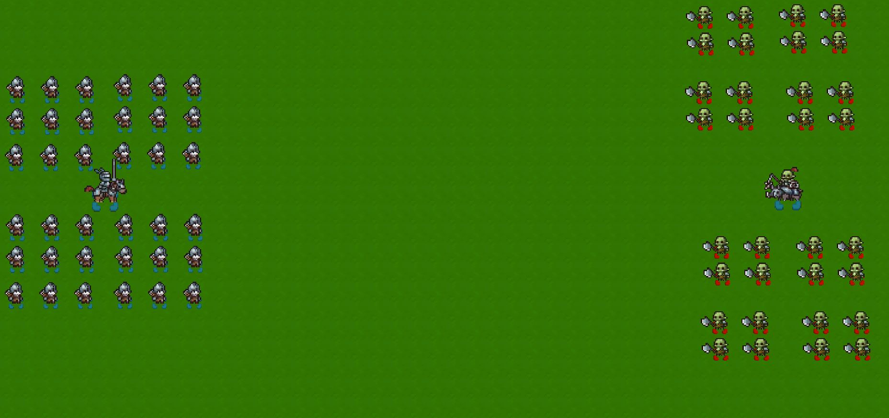

The game features two opposing armies, each led by a commander. The primary objective is to eliminate the enemy commander—whichever army succeeds first wins the battle.

All units, including commanders, share a common set of combat-relevant attributes that influence AI decision-making:

`Health` – Determines how much damage a unit can sustain before being defeated.

`Energy` – Consumed when performing attacks; limits sustained offensive actions.

`Morale` – Represents a unit’s willingness to fight; if morale breaks, the unit flees the battlefield.

`Movement Speed` – Affects how quickly a unit can reposition or chase enemies.

`Attack Damage` – The amount of damage dealt per hit.

`Attack Speed` – The rate at which a unit can deliver attacks.

`Attack Range` – The maximum distance from which a unit can engage an enemy.

`Dodge Chance` – The probability of avoiding incoming attacks.

## 2. Inspirations
The following games inspired this system's design:

- *Star Wars: Empire at War* – AI that intelligently chooses when to attack, defend, or retreat based on fleet strength and positioning  
- *Supreme Commander* – Emphasizes long-term strategic planning and economy-driven decisions  
- *Total War* franchise – Tactical AI that considers morale, unit matchups, and terrain  
- *Command & Conquer* – Known for aggressive, fast-paced AI with multiple attack patterns

## 3. System Architecture
The RTS AI is built using Unity and C#. It extends from an abstract `RTS_AI` class and implements core decision-making in `PersonalityDrive_AI`, which is tailored by AI personalities.

### 3.1 RTS_AI (Base Class)
This abstract base class defines:

- Mission management (assignment, cancellation, queueing)  
- Evaluation of ongoing missions  
- Unit handling for allies and enemies  
- Utility functions like attack power calculation and unit proximity

Mission are managed within the Base class to keep the derived class clean and if we were to make another AI child class it will have the same foundation of the mission based system.

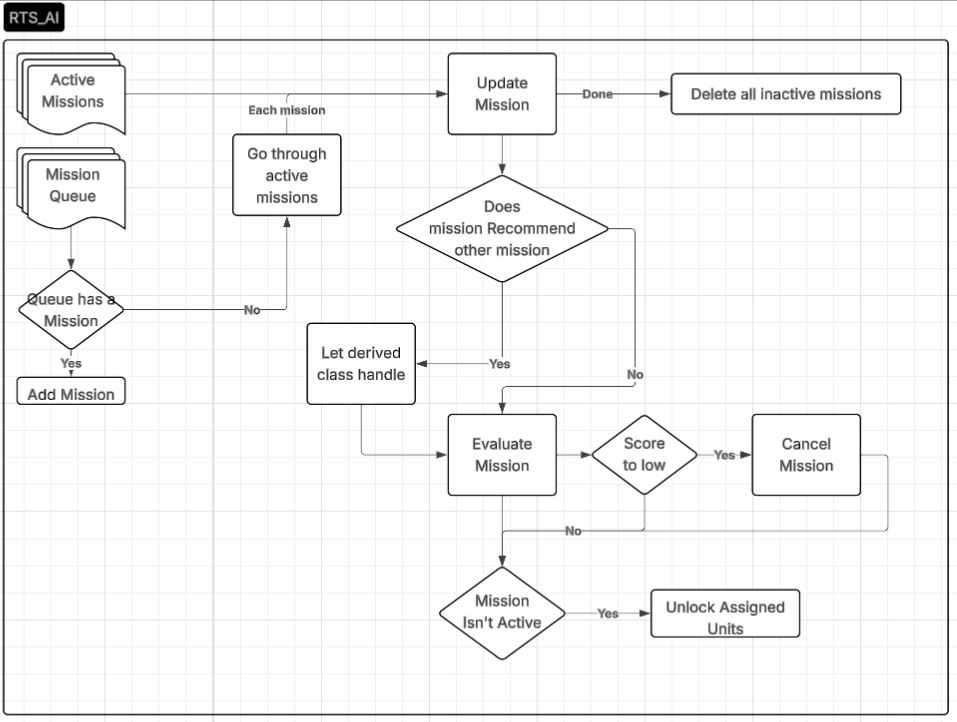

### 3.2 PersonalityDrive_AI (Derived Class)
A specific implementation of the RTS AI using "personality profiles" (`AI_Personality`) that affect decision weights and thresholds. It includes:

- Power comparison and enemy proximity analysis  
- Tension and urgency modeling to influence mission timing  
- A scoring system for previewing potential mission success

### 3.3 Mission System
The AI makes decisions by scoring mission types:

- **Attack** – Engage enemy commander or nearby threats  
- **Defend** – Protect key ally units  
- **Retreat** – Regroup to safe zones  
- **Move** – Reposition to tactically advantageous tiles

A `PreviewMissionResult` structure encapsulates an estimated score and data, such as selected squad and targets, before executing a mission.

## 4. Smart Decision Making
The AI gathers real-time data on:

- Total combat power of allies vs enemies  
- Distance between units (proximity = tension)  
- Morale, energy, and availability of troops

It computes metrics such as `PowerRatio` and `Tension`:

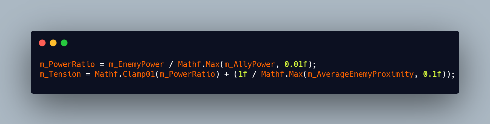

These influence the `Urgency`, determining how soon the AI should re-evaluate:

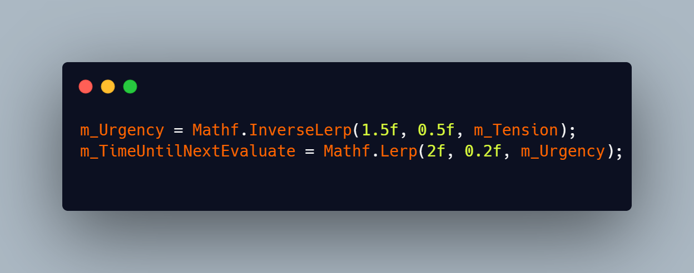

The AI then scores missions dynamically and selects the highest scoring one, ensuring relevance to the current game context. Each mission should have a static method which uses the same evaluation as the one used while it's active. This way we can predict if a mission instantly gets cancelled or not.

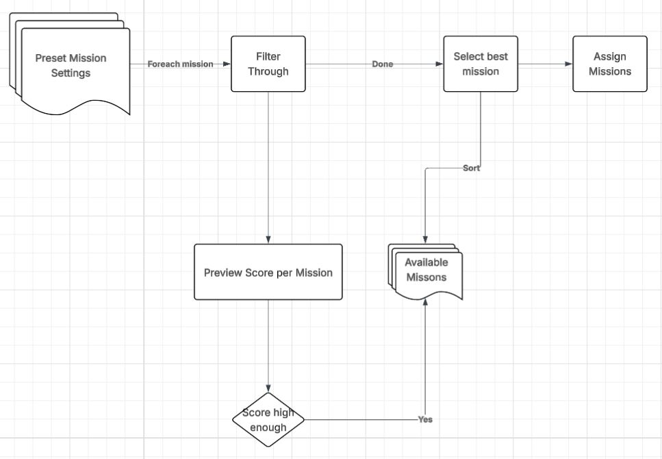

## 5. Attack Strategy Evaluation
To decide whether to attack the enemy commander, the AI compares total squad power (with an error margin) against the enemy's known power in the commander’s vicinity:

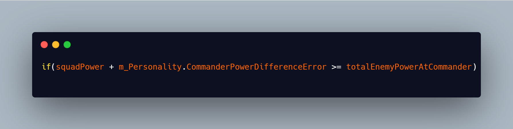

If viable, it initiates a commander-targeted attack. If not, it searches for the nearest enemy cluster and scores that opportunity. This ensures aggressive but calculated behavior.

### Targeting Logic Example:
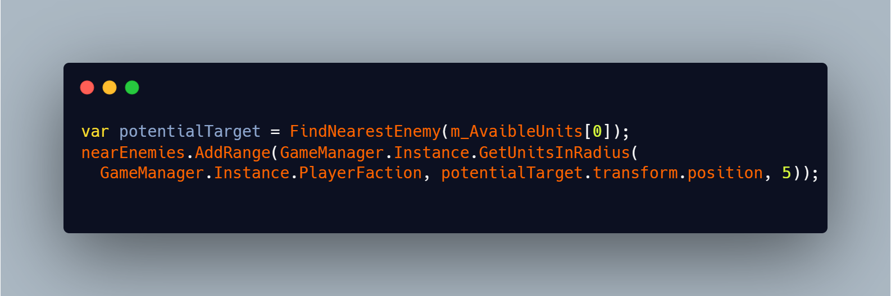

## 6. Mission Conversion

Missions update themselves and define if they are failing or complete. While doing that, they also evaluate their score again so that the AI can choose to keep it or not.

Sometimes a mission needs a specific solution—for example, an attack that needs to be converted to a retreat.

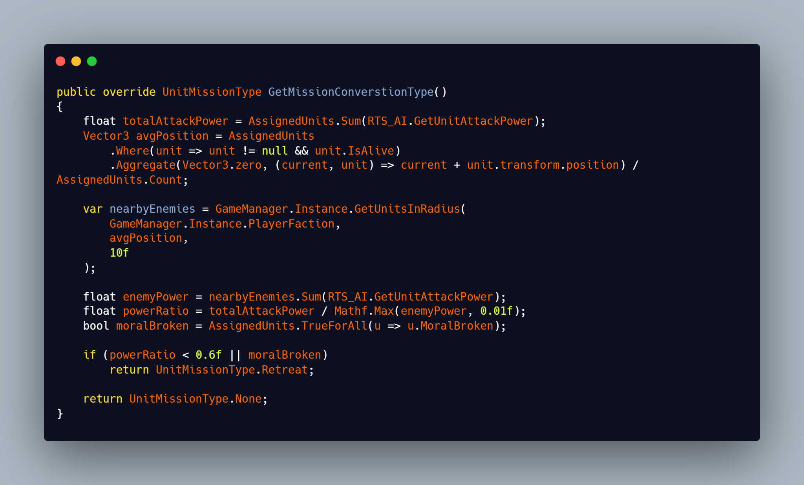

This way missions can be converted to another mission with the same units.

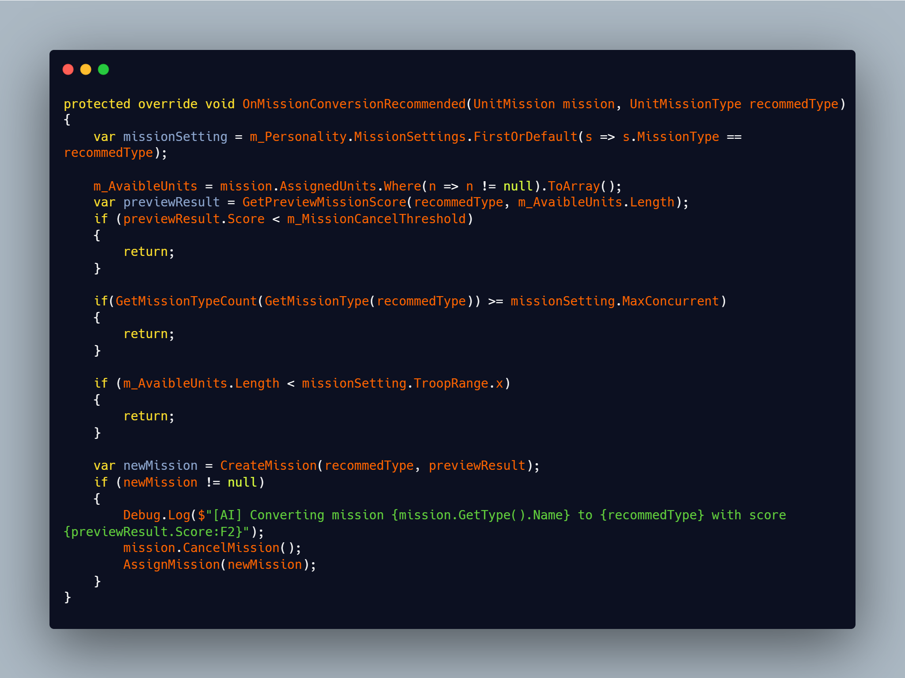

## 7. Difficulty Scaling

Difficulty is influenced by `AI_Personality`, which contains tunable fields like:

- `MissionCancelThreshold` – How tolerant the AI is of low-value actions  
- `TroopRange` – Number of troops to commit to missions  
- `CommanderPowerDifferenceError` – How risk-averse the AI is

By adjusting these personality profiles, multiple difficulty tiers can be defined, But also by adjust the mission settings for each AI. Changing the Max Concurrent on a mission only allows a certain amount of those missions to exist at the same time. Or changing the troop range, Making mission either small scale or large scale. And if you were to combine this with a Third part where the Preset Personality changes over course of the game. You can create very unique behaviour.

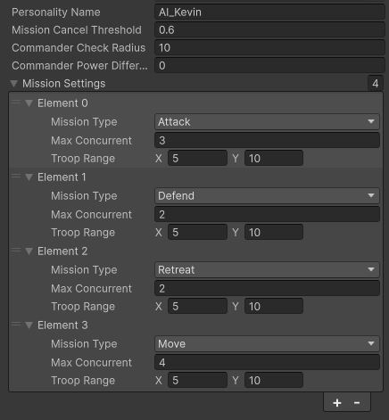

- **Easy AI**: Avoids risky attacks, slow urgency, low aggression  
- **Medium AI**: Balanced decision-making, moderate risk-taking  
- **Hard AI**: Aggressive behavior, minimal error margin, higher urgency

## 8. Stats Map

The AI needs to estimate where to go or where to avoid. For that it uses `StatsGrid` to make its choices.

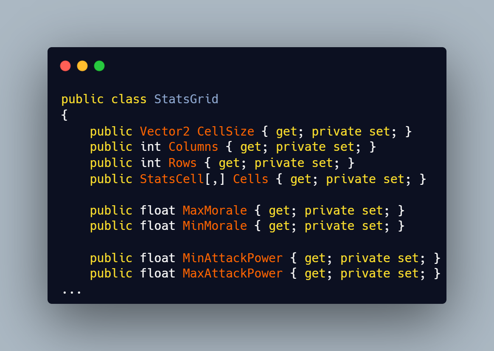  
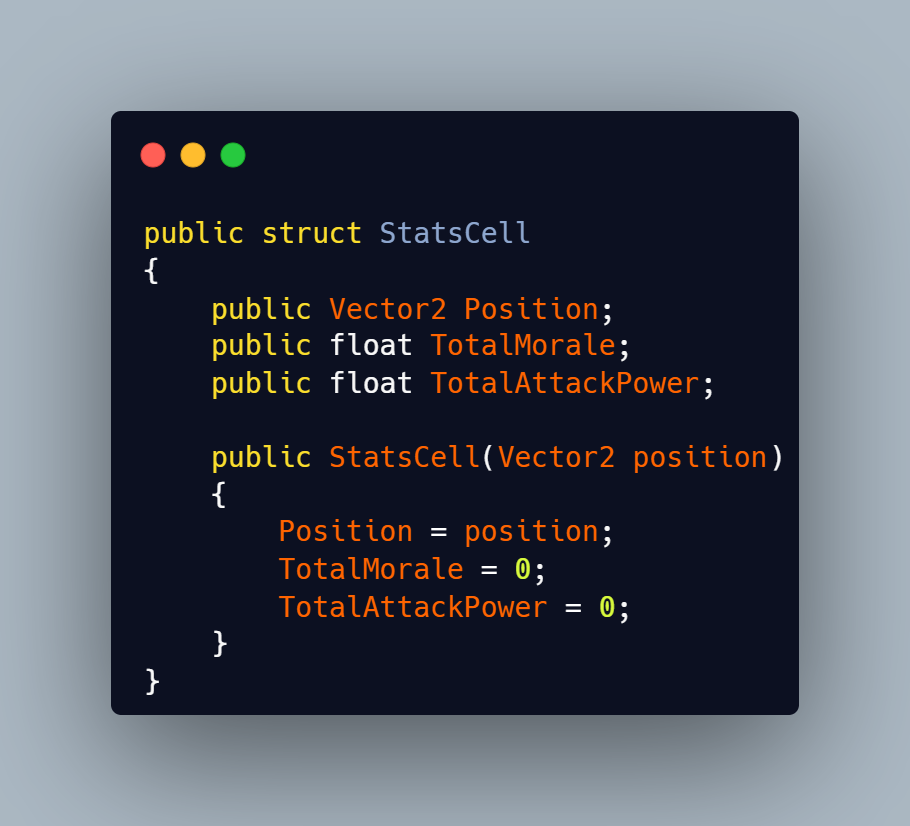

This data is then used to determine where a faction is holding an advantage, where the AI might want to move to gain a better position, or to evaluate if the enemy has a strong presence in a certain area. Currently, this data is separate from the partitioning grid (which shouldn't be the case); it should all be in the same grid to save memory and avoid the overhead of creating a new grid every frame. However, for this small project, I thought it would suffice to do it this way.

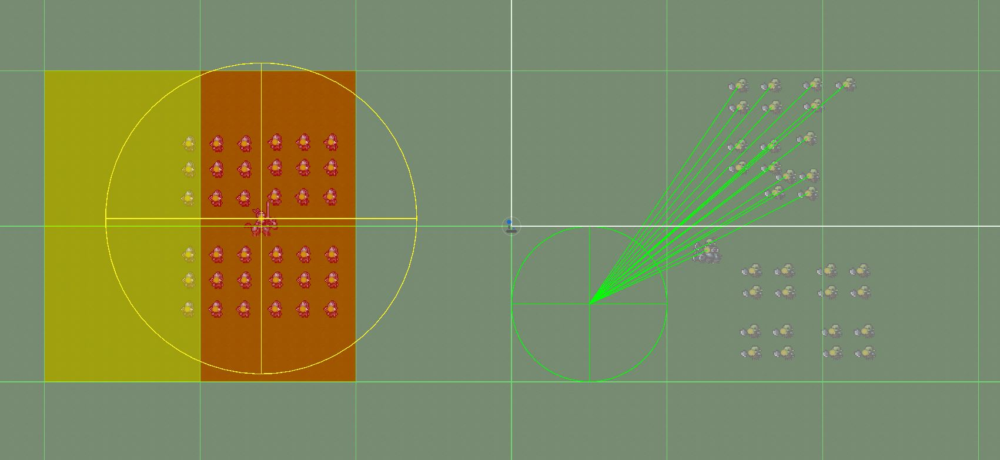
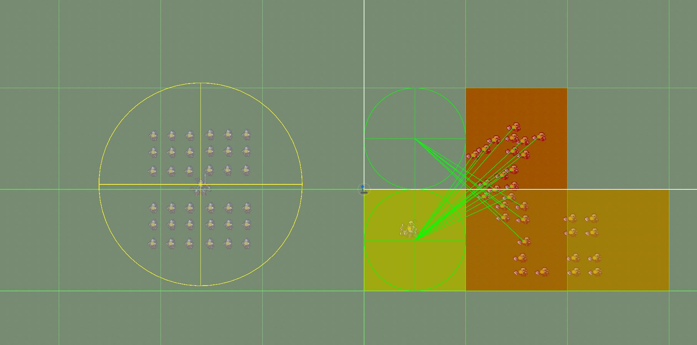

It can also view morale stats to show whether the player or the AI has a stronger morale presence. This is a good indication for the AI to determine if its army is faltering. Although this is also being checked through total attack power, morale is still being taken into consideration.

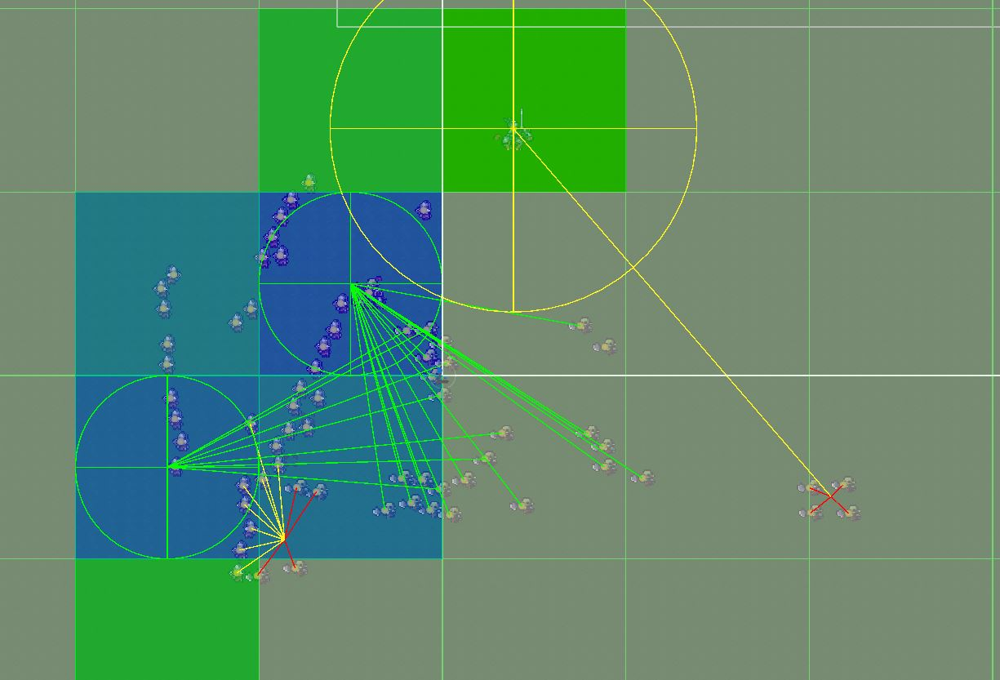

## After word

The RTS genre has always been a fascinating topic to me and I suspect to many other developers as well. It requires solving problems across a wide range of domains: memory overhead, O(n²) operations, pathfinding (not in my case), slow iteration cycles, and so on. Despite the challenges, these problems are truly interesting but none quite as fascinating as the most important one: the AI.

Figuring out the right level of abstraction for the AI was quite difficult. How much should be hardcoded, and how much should be abstracted into a class or struct? The truth is, there’s no consistent answer, it depends heavily on the type of RTS you're building. In my case, it led to a hybrid approach.

For example, the decision to either attack the commander or the units at the weakest total attack power position was a design choice I made. However, which mission the AI chooses to begin with is not up to me, that’s determined by the AI, based on which option scores best according to its evaluation. I found this to be a very creative solution, but I would love the chance to start from a blank canvas again and explore whether I could introduce even more layers of abstraction into the AI.

# Sources

- [A Survey of Real-Time Strategy Game AI Research and Competition in StarCraft](https://www.researchgate.net/publication/260711387_A_Survey_of_Real-Time_Strategy_Game_AI_Research_and_Competition_in_StarCraft)
- [Artificial Intelligence Design for Real-time Strategy Games](https://people.montefiore.uliege.be/fsafadi/nips2011.pdf)
- [A Review of Real-Time Strategy Game AI](https://ojs.aaai.org/aimagazine/index.php/aimagazine/article/download/2478/2457)
- [RTS AI: Problems and Techniques](http://www.cs.mun.ca/~dchurchill/publications/pdf/ecgg15_chapter-rts_ai.pdf) 
- [Exploring the AI of Command & Conquer | AI and Games #53](https://www.youtube.com/watch?v=Wb84Vi7XFRg&list=PLokhY9fbx05eq8SvcNOxYRquYMzMjF9Ok&index=28&pp=iAQB)
- [The AI of Empire: Total War | AI and Games #22](https://www.youtube.com/watch?v=KL_AAGSivbI&list=PLokhY9fbx05eq8SvcNOxYRquYMzMjF9Ok&index=59&pp=iAQB)
- [The AI of Shogun: Total War | AI and Games #21](https://www.youtube.com/watch?v=XBzTJOYgW0M&list=PLokhY9fbx05eq8SvcNOxYRquYMzMjF9Ok&index=60)

